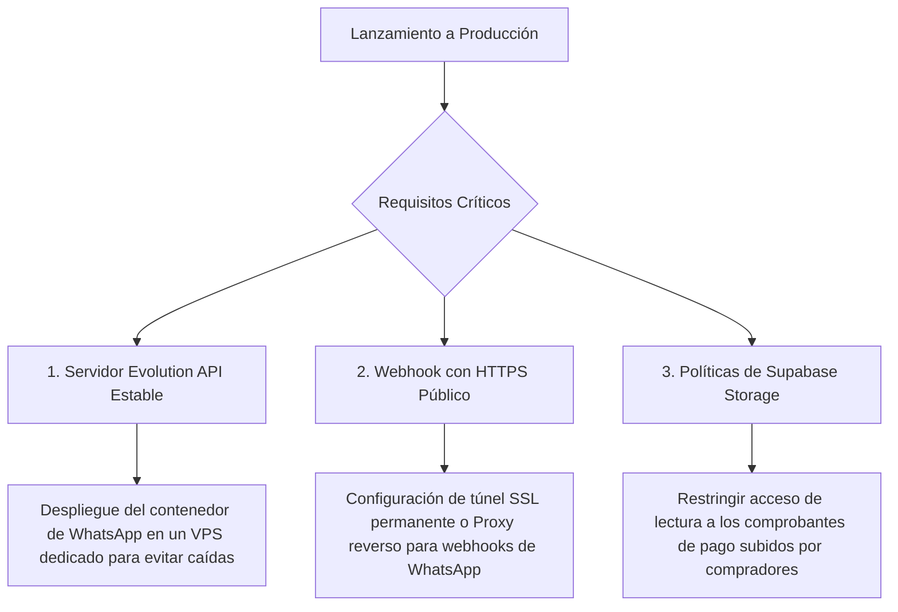

# FlashCheckout v1.0 — Informe de Estado y Enfoque Operativo/Estratégico

## 01. Enfoque Directo y Operativo

### Estado Actual del MVP (Status Report)
El MVP de **FlashCheckout** está completamente desarrollado y ha superado la etapa inicial de prototipo básico para consolidarse como una solución de nivel empresarial (**v1.0**). El sistema cuenta con una arquitectura multi-inquilino (*multi-tenant*) funcional integrada con **Next.js 16.2 (App Router + Turbopack)**, **Prisma 7**, **Supabase (PostgreSQL)** y **Clerk 7**.

El flujo operativo principal está 100% implementado y auditado visualmente para cumplir con las directrices de diseño plano y minimalista. Las dos interfaces más complejas y críticas del administrador de comercios han sido rediseñadas con calidad de producción:
1.  **Ventas Registradas (`/pedidos`):** Rediseñado por completo a partir del mockup conceptual, pasando de una pantalla dividida simple a un panel consolidado de alta densidad. Incluye tarjetas de KPI superior, buscador reactivo y filtros de pago, una tabla estructurada con paginación, widgets analíticos en el lateral (gráfico donut de Recharts, barras de progresión de pasarelas y actividad reciente) y un modal lateral deslizable (drawer) para detalles logísticos avanzados.
2.  **Bandeja de Historial de Chats (`/historial-chats`):** Reestructurado en una interfaz premium de tres columnas. Posee listado de chats con buscador y paginación, avatares enriquecidos con el logotipo oficial de WhatsApp, panel central de chat en vivo con burbujas inteligentes de recomendación de productos, y un sidebar CRM para asignación de asesores, toggle de favoritos, asignación dinámica de etiquetas y pizarra interactiva de notas internas persistidas en la base de datos.

---

### Cambios Clave y Consistencia Visual Reciente
Durante la última fase de optimización, se resolvieron las discrepancias de diseño y dependencias locales para asegurar la consistencia del producto:
*   **Unificación Estética Flat (Shadow-Free):** Se eliminaron todas las clases de sombras en caja (`shadow`, `shadow-sm`) de las tarjetas de KPI, la tabla de pedidos, las columnas del chat y los widgets del sidebar. El diseño ahora es completamente plano (Flat UI) y minimalista, reservando las sombras sutiles únicamente para los botones de acción principales (como *"Exportar"* o *"Cerrar conversación"*).
*   **Ajuste de Tipografía y Casing:** Se unificó la fuente global a la familia tipográfica Geist (heredada del layout del dashboard) y se eliminaron las mayúsculas sostenidas (`uppercase`) de las barras de navegación, menús laterales, enlaces operacionales e indicadores de estado, dejándolos en un formato limpio de capitalización regular (Sentence Case).
*   **Línea Base del Chat Bidireccional:** Se solucionó el problema del chat de un solo lado envolviendo el cliente de mensajería `waClient` en la lógica del bot (`chatbot-logic.ts`) y modificando el endpoint manual `/api/whatsapp/send`. Ahora, cada respuesta automática del bot de IA y cada mensaje enviado manualmente por el asesor desde el dashboard se guardan instantáneamente en la base de datos de Prisma, mostrando un flujo de conversación realista y ordenado de ambos lados (cliente a la izquierda, bot/asesor a la derecha).

---

## 02. Enfoque Estratégico y de Negocio

El diseño técnico de FlashCheckout responde de manera directa a la realidad comercial de las micro y pequeñas empresas en Latinoamérica (LATAM), enfocándose en eliminar fricción de compra y automatizar la post-venta:

*   **Reducción del Tiempo de Cierre:** El 70% de las ventas iniciadas en redes sociales se pierden en el proceso de coordinar la disponibilidad, los datos de envío y el método de pago a través de chat humano. Al utilizar el catálogo interactivo auto-generado (`/tienda/[slug]`) y el bot conversacional de WhatsApp, estructuramos el pedido en un resumen unificado. Esto reduce el proceso de compra de 20 minutos a **menos de 30 segundos**.
*   **El Efectivo y la Contraentrega como Estándar:** Dado que el efectivo sigue dominando las transacciones de comercios locales, integramos un flujo logístico con conductores asignados (`Driver`) y control de estado de entrega, permitiendo gestionar despachos propios o tercerizados y liberar depósitos con confianza mediante un control "escrow" local.
*   **Aceptación de Transferencias Manuales (Nequi/Daviplata):** Permitimos a las tiendas operar desde el día uno con transferencias móviles inmediatas. El comprador sube la captura de pantalla de su pago, y el vendedor puede auditar y aprobar el comprobante desde un panel de verificación manual unificado. Esto elimina la barrera técnica inicial de configurar pasarelas de pago tradicionales.

---

## 03. Qué Falta para estar Listo para Producción (Gap Analysis)

Para realizar el despliegue a producción y recibir a los primeros clientes reales, es necesario completar los siguientes pendientes críticos de seguridad, infraestructura y automatización:

### 1. Infraestructura y Despliegue de Evolution API
*   **La Brecha:** Actualmente la Evolution API corre en un contenedor local de Docker (`evoapicloud/evolution-api:latest`) usando el puerto `8080` y una base de datos local compartida. Esta configuración es ideal para desarrollo pero inviable para producción.
*   **Acción Requerida:** 
    - Desplegar la Evolution API en un servidor **VPS dedicado** (como AWS, DigitalOcean o VPS local con IP pública).
    - Montar un balanceador de carga y configurar almacenamiento persistente dedicado (PostgreSQL) para evitar la pérdida de sesiones y credenciales de WhatsApp cuando el contenedor se reinicie.
    - Asegurar que la comunicación viaje cifrada bajo HTTPS.

### 2. Exposición y Estabilidad del Webhook (Túneles Estables)
*   **La Brecha:** Las notificaciones entrantes de mensajes de clientes necesitan una IP o dominio público para llegar al backend de Next.js (`/api/whatsapp/webhook`). En desarrollo, esto depende de túneles temporales de Cloudflare o ngrok que expiran constantemente.
*   **Acción Requerida:** Configurar un subdominio de producción dedicado (ej. `api.flashcheckout.com/api/whatsapp/webhook`) y mapearlo a través de un proxy reverso (Nginx) o un **Cloudflare Tunnel permanente configurado como servicio del sistema**, garantizando que el bot nunca pierda conexión con WhatsApp por expiración de URLs.

### 3. Políticas de Seguridad de Supabase Storage (Privacidad de Comprobantes)
*   **La Brecha:** Las imágenes del comprobante de pago cargadas por los clientes se guardan en Supabase Storage. Si el bucket es público, cualquier usuario con la URL podría acceder a datos bancarios e información personal de otros compradores.
*   **Acción Requerida:** 
    - El bucket para las fotos de productos debe permanecer **público** para renderizado del catálogo.
    - El bucket para los comprobantes de pago debe configurarse como **privado**.
    - Implementar la generación de **URLs firmadas temporalmente (Signed URLs)** con expiración corta (ej. 5 minutos) cuando el vendedor solicite auditar el comprobante desde su panel de control privado, protegiendo los datos financieros de los compradores.

---

## 04. Matriz de Funcionalidades y Porcentaje de Terminación

| Módulo | Funcionalidad Específica | Archivos/Rutas Clave | Estado | % Completado | Notas / Observaciones |
| :--- | :--- | :--- | :--- | :---: | :--- |
| **01. Catálogo & Checkout** | Catálogo Público Dinámico | [`app/tienda/[slug]/page.tsx`](file:///c:/Users/david/flashcheckout/app/tienda/%5Bslug%5D/page.tsx) | Completo | **100%** | Renderizado del lado del servidor (Next.js 16 RSC). |
| | Carrito de Compras en Cliente | [`components/CheckoutForm.tsx`](file:///c:/Users/david/flashcheckout/components/CheckoutForm.tsx) | Completo | **100%** | Manejo de cantidades límite con validación de stock físico. |
| | Formulario del Comprador | [`components/CheckoutForm.tsx`](file:///c:/Users/david/flashcheckout/components/CheckoutForm.tsx) | Completo | **100%** | Captura de datos básicos de entrega (Nombre, Dirección, Ciudad). |
| | Generador de Deep-Link WhatsApp | [`lib/whatsapp.ts`](file:///c:/Users/david/flashcheckout/lib/whatsapp.ts) | Completo | **100%** | Estructuración y codificación del mensaje de pedido de WhatsApp. |
| **02. Panel del Vendedor** | Métricas y Dashboard Principal | [`app/(dashboard)/dashboard/page.tsx`](file:///c:/Users/david/flashcheckout/app/(dashboard)/dashboard/page.tsx) | Completo | **100%** | Vista unificada de ventas totales, pedidos y crecimiento. |
| | CRUD Catálogo de Productos | [`components/ProductManager.tsx`](file:///c:/Users/david/flashcheckout/components/ProductManager.tsx) | Completo | **100%** | Panel para crear, editar, eliminar y categorizar productos. |
| | Gestor de Pedidos / Órdenes | [`components/OrderList.tsx`](file:///c:/Users/david/flashcheckout/components/OrderList.tsx) | Completo | **100%** | Vista de tabla de alta densidad con KPI, donuts de analíticas y detalles logísticos en modal. |
| | Configuración de Tienda | [`components/StoreSettingsManager.tsx`](file:///c:/Users/david/flashcheckout/components/StoreSettingsManager.tsx) | Completo | **100%** | Edición de Bio, Logo, WhatsApp y metadatos de marca. |
| | Carga de Imágenes al Storage | [`app/api/upload/route.ts`](file:///c:/Users/david/flashcheckout/app/api/upload/route.ts) | Completo | **100%** | Integración nativa con buckets públicos de Supabase Storage. |
| **03. Agente de IA (Chatbot)**| Panel de Configuración Agente | [`app/(dashboard)/agente/page.tsx`](file:///c:/Users/david/flashcheckout/app/(dashboard)/agente/page.tsx) | Completo | **100%** | Ajuste de prompts de comportamiento y mensaje de bienvenida. |
| | Lógica de Chatbot Conversacional | [`lib/bot/chatbot-logic.ts`](file:///c:/Users/david/flashcheckout/lib/bot/chatbot-logic.ts) | Funcional | **100%** | Lógica de estados robusta con persistencia automática de respuestas del bot. |
| | Webhook WhatsApp (Evolution) | [`app/api/whatsapp/webhook/route.ts`](file:///c:/Users/david/flashcheckout/app/api/whatsapp/webhook/route.ts) | Funcional | **95%** | Parseo de mensajes, ubicación y carga de comprobantes. Pendiente túnel público estable. |
| | Historial de Conversación CRM | [`components/ChatHistoryViewer.tsx`](file:///c:/Users/david/flashcheckout/components/ChatHistoryViewer.tsx) | Completo | **100%** | Panel de 3 columnas plano con persistencia en DB para notas, etiquetas, favoritos y asesores. |
| **04. Métodos de Pago** | Suscripción de Tiendas (SaaS) | [`lib/subscription.ts`](file:///c:/Users/david/flashcheckout/lib/subscription.ts) | Completo | **100%** | Cobro recurrente mensual de USD $15 con Stripe Billing. |
| | Stripe Connect para Vendedores | [`components/StripeConnectSection.tsx`](file:///c:/Users/david/flashcheckout/components/StripeConnectSection.tsx) | Completo | **100%** | Permite a los comercios cobrar directo y transferir sus saldos. |
| | Pasarela MercadoPago (Connect) | [`lib/mercadopago.ts`](file:///c:/Users/david/flashcheckout/lib/mercadopago.ts) / OAuth | Completo | **100%** | Cobros digitales mediante Mercado Pago Connect OAuth 2.0. |
| | Verificación de Transf. Manuales | [`components/dashboard/ManualVerificationPanel.tsx`](file:///c:/Users/david/flashcheckout/components/dashboard/ManualVerificationPanel.tsx) | Completo | **100%** | Visualización de comprobante de pago subido por el comprador. |
| **05. Seguridad & KYC** | Validación OTP de WhatsApp Admin | [`components/dashboard/StoreVerificationManager.tsx`](file:///c:/Users/david/flashcheckout/components/dashboard/StoreVerificationManager.tsx) | Completo | **100%** | Código de 6 dígitos para validar la propiedad del WhatsApp. |
| | Validación de Identidad (KYC) | [`components/dashboard/StoreVerificationManager.tsx`](file:///c:/Users/david/flashcheckout/components/dashboard/StoreVerificationManager.tsx) | Completo | **100%** | Carga de cédula a Supabase para desbloqueo de Nivel 1. |
| | Control de Límites por Nivel | [`app/(dashboard)/verificaciones/page.tsx`](file:///c:/Users/david/flashcheckout/app/(dashboard)/verificaciones/page.tsx) | Completo | **100%** | Bloqueo de ventas al superar 500k COP o 10 pedidos en Nivel 0. |
| | Reportes de Fraude (Strikes) | [`prisma/schema.prisma`](file:///c:/Users/david/flashcheckout/prisma/schema.prisma) | Completo | **100%** | Suspensión automática del catálogo si acumula quejas. |
| **06. Logística / Domicilios**| Registro de Repartidores | [`components/LogisticsManager.tsx`](file:///c:/Users/david/flashcheckout/components/LogisticsManager.tsx) | Completo | **100%** | Altas, bajas, métricas y calificaciones del repartidor (`Driver`). |
| | Asignación y Control Escrow | [`components/LogisticsManager.tsx`](file:///c:/Users/david/flashcheckout/components/LogisticsManager.tsx) | Completo | **100%** | Flujo de entrega física y liberación del pago tras la entrega. |
